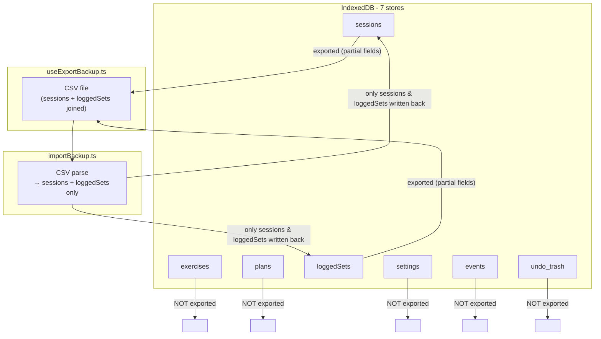

# Backup Export/Import Inconsistency Report

## Architecture overview

The export writes a **single flat CSV** (one row per loggedSet × session). The import reads that CSV and reconstructs only `sessions` and `loggedSets` records. Everything else in IndexedDB is silently ignored.



---

## 1. Entire stores never exported or imported

| Store        | Type              | Severity     | Notes                                                                                                                                                                                                                   |
| ------------ | ----------------- | ------------ | ----------------------------------------------------------------------------------------------------------------------------------------------------------------------------------------------------------------------- |
| `exercises`  | `ExerciseDTO`     | **Critical** | Exercise definitions (name, category, equipment, notes, guideLinks) are completely absent. After import on a new device every `exerciseId` in loggedSets is a dangling reference; only `exerciseNameSnapshot` survives. |
| `plans`      | `PlanDTO`         | **Critical** | Plan definitions gone. Every `sourcePlanId` on imported sessions becomes a dangling reference.                                                                                                                          |
| `settings`   | `SettingEntryDTO` | **High**     | User preferences, exercise defaults (`ExerciseDefaultsDTO`), weight-unit preference, and import history are all lost.                                                                                                   |
| `events`     | `EventRecordDTO`  | Low          | Telemetry/audit log — omission is likely intentional.                                                                                                                                                                   |
| `undo_trash` | `TrashRecordDTO`  | Low          | Ephemeral undo window — omission is intentional.                                                                                                                                                                        |

---

## 2. Missing fields in SessionDTO export/import

`SessionDTO` has 8 fields; the backup round-trip only covers 6.

- `**workoutType?: WorkoutType | null` — never written to the CSV, never read back on import. `createSessionPayload` in `[src/lib/utils/importBackup.ts](src/lib/utils/importBackup.ts)` builds the object without this field; it silently becomes `undefined` on every import.
- `**exerciseOrder?: UUID[]` — the ordered list of exercises within a session. Not exported, not imported. After import the session UI will render exercises in an indeterminate order.

Relevant constructor (lines 303-322 of `importBackup.ts`):

```typescript
// workoutType and exerciseOrder are absent — both silently dropped
return {
  id: sessionId,
  name: row.sessionName || undefined,
  date: ...,
  status: row.sessionStatus,
  sourcePlanId: row.sourcePlanId || undefined,
  createdAt: ...,
  updatedAt: ...,
};
```

---

## 3. Missing fields in LoggedSetDTO export/import

`LoggedSetDTO` has 16 fields; the backup round-trip only covers 13.

- `**status?: LoggedSetStatus**` (`"pending" | "completed" | "skipped"`) — not exported, not imported. All sets lose their completion state and become `undefined` on import.
- `**setIndex?: number**` — a secondary ordering field distinct from `orderIndex`. Not exported, not imported.

---

## 4. Logic bug — alternative exerciseId fabrication

In `[src/lib/utils/importBackup.ts](src/lib/utils/importBackup.ts)` lines 328-343:

```typescript
const altExerciseId = row.alternativeExerciseId || undefined;
const altSnapshot = altExerciseId || row.alternativeExerciseName
  ? {
      exerciseId: altExerciseId ?? createUUID(),   // <-- BUG
      ...
    }
  : null;
```

If a set had an alternative exercise name but an empty `alternativeExerciseId` (which happens when the alternative exercise store entry didn't export), a **brand-new random UUID is minted** on every import. This means:

- The alternative will never resolve to any real exercise in the exercises store.
- Re-importing the same file a second time creates a different UUID each time.
- The `exerciseIds` denormalized array on the set also gets this phantom ID, poisoning multiEntry index queries.

---

## 5. Type coercion issue — weightUnit empty string

In `buildSessionRow` (`[src/lib/utils/importBackup.ts](src/lib/utils/importBackup.ts)` line 163):

```typescript
weightUnit: (cells["Unit"]?.trim() as WeightUnit) ?? "",
```

`WeightUnit = "kg" | "lb"`, so `""` is not a valid value, yet this can produce it. It works only because `createLoggedSetPayload` later converts it with `row.weightUnit || undefined`. The intermediate typed value is incorrect and could break if any intermediate consumer reads `row.weightUnit` directly.

---

## 6. validateRow gaps

`validateRow` in `[src/lib/utils/importBackup.ts](src/lib/utils/importBackup.ts)` does not flag:

- A row where `sessionDate` is `NaN` and `sessionCreatedAt` is also `NaN` (the fallback `resolveSessionDate` would return `NaN`, which is stored as the session date).
- A row with no `sessionId` — this is silently accepted and uses name+date as a grouping key; if that key is also missing/empty, many rows could collapse into a single session with an empty name.
- An unrecognized `setType` value — any arbitrary string is cast directly as `SetType` with no validation.

---

## 7. Orphaned cross-store references after import

Even if the CSV is internally consistent, importing to a fresh install leaves:

- `loggedSet.exerciseId` → no matching record in `exercises` store
- `loggedSet.alternative.exerciseId` → no matching record in `exercises` store
- `session.sourcePlanId` → no matching record in `plans` store

Any feature that joins these (exercise name lookups, plan-based filtering, analytics grouping) will silently fail or show blank data.

---

## Summary table

| #   | Category              | Severity | Item                                                           |
| --- | --------------------- | -------- | -------------------------------------------------------------- |
| 1   | Missing store         | Critical | `exercises` not backed up                                      |
| 2   | Missing store         | Critical | `plans` not backed up                                          |
| 3   | Missing store         | High     | `settings` not backed up                                       |
| 4   | Missing field         | High     | `SessionDTO.workoutType` dropped                               |
| 5   | Missing field         | High     | `SessionDTO.exerciseOrder` dropped                             |
| 6   | Missing field         | High     | `LoggedSetDTO.status` dropped                                  |
| 7   | Missing field         | Medium   | `LoggedSetDTO.setIndex` dropped                                |
| 8   | Logic bug             | High     | Alternative `exerciseId` fabricated on every import when blank |
| 9   | Type issue            | Low      | `weightUnit` coerced to `""` intermediately                    |
| 10  | Validation gap        | Medium   | NaN session date, empty setType, missing sessionId not caught  |
| 11  | Referential integrity | Medium   | All cross-store IDs become dangling on a clean install         |
