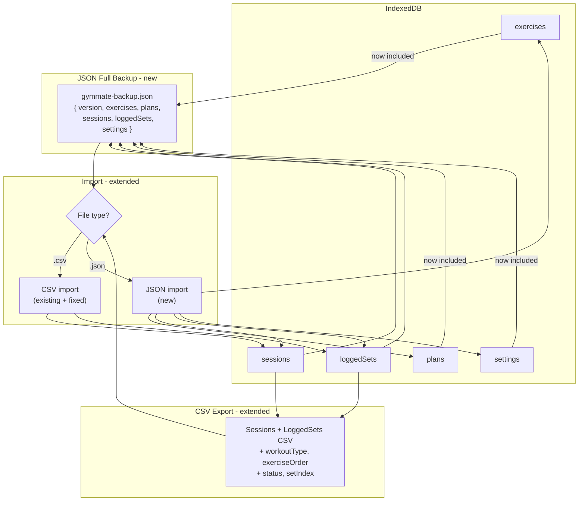

# Backup Fix & Full Backup Implementation Plan

## Architecture after the fix



---

## Task 1 — Fix missing fields in the CSV round-trip

Report items: #4 `workoutType`, #5 `exerciseOrder`, #6 `LoggedSetDTO.status`, #7 `setIndex`

### 1a. `[src/hooks/useExportBackup.ts](src/hooks/useExportBackup.ts)`

Add four fields to `SessionExportRow`:

```typescript
workoutType: WorkoutType | null | "";
exerciseOrder: string; // JSON-serialised UUID[] e.g. '["uuid1","uuid2"]'
setStatus: LoggedSetStatus | "";
setIndex: number | "";
```

Add four entries to `SESSION_EXPORT_COLUMNS` (after `sessionStatus` and `orderIndex` respectively):

```typescript
{ header: "Workout type",   key: "workoutType" },
{ header: "Exercise order", key: "exerciseOrder" },   // formatter: JSON.stringify array
{ header: "Set status",     key: "setStatus" },
{ header: "Set index",      key: "setIndex" },
```

Update `createRow()` to populate them:

```typescript
workoutType:   session.workoutType ?? "",
exerciseOrder: session.exerciseOrder?.length
                 ? JSON.stringify(session.exerciseOrder) : "",
setStatus:     set.status ?? "",
setIndex:      set.setIndex ?? "",
```

### 1b. `[src/lib/utils/importBackup.ts](src/lib/utils/importBackup.ts)`

`**buildSessionRow()**` — parse new columns:

```typescript
workoutType:   cells["Workout type"]?.trim() || "",
exerciseOrder: cells["Exercise order"]?.trim() ?? "",
setStatus:     cells["Set status"]?.trim() ?? "",
setIndex:      toOptionalNumber(cells["Set index"]),
```

`**createSessionPayload()**` — hydrate the two new `SessionDTO` fields:

```typescript
workoutType:   (row.workoutType as WorkoutType) || undefined,
exerciseOrder: (() => {
  try { return row.exerciseOrder ? JSON.parse(row.exerciseOrder) : undefined; }
  catch { return undefined; }
})(),
```

`**createLoggedSetPayload()**` — hydrate `status` and `setIndex`:

```typescript
status:   (row.setStatus as LoggedSetStatus) || undefined,
setIndex: typeof row.setIndex === "number" ? row.setIndex : undefined,
```

---

## Task 2 — Fix the alternative exerciseId bug (#8)

In `createLoggedSetPayload()`, the current code mints a random UUID when `altExerciseId` is blank but `altExerciseName` is present. Replace with:

```typescript
// Only create an altSnapshot if we have a real exerciseId.
// A name without an ID is unresolvable; fabricating an ID poisons multiEntry indexes.
const altSnapshot =
  altExerciseId
    ? {
        exerciseId: altExerciseId,
        nameSnapshot: row.alternativeExerciseName || undefined,
        weight: ...,
        reps:   ...,
      }
    : null;
```

Remove the `createUUID()` call from this path entirely. Document the limitation inline: full exercise resolution requires a JSON full backup (Task 4).

---

## Task 3 — Fix type and validation issues (#9, #10)

### 3a. `weightUnit` coercion (#9) in `buildSessionRow()`

```typescript
// Before (wrong): (cells["Unit"]?.trim() as WeightUnit) ?? ""
// After (correct):
weightUnit: (cells["Unit"]?.trim() as WeightUnit) || undefined,
```

The `SessionExportRow.weightUnit` type changes to `WeightUnit | undefined`.

### 3b. `validateRow()` gaps (#10)

Add three new checks:

```typescript
// NaN session date — both date columns are unparseable
if (
  !Number.isFinite(row.sessionDate) &&
  !Number.isFinite(row.sessionCreatedAt)
) {
  issues.push("Session date is missing or unparseable");
}

// Missing session ID — rows will be collapsed by name+date which may also be empty
if (!row.sessionId) {
  issues.push("Session ID is missing; rows will be grouped by name and date");
}

// Unrecognised set type — stored verbatim, could corrupt index queries
const VALID_SET_TYPES: SetType[] = [
  "warmup",
  "main",
  "drop",
  "drop set",
  "accessory",
];
if (row.setType && !VALID_SET_TYPES.includes(row.setType)) {
  issues.push(`Unknown set type: "${row.setType}"`);
}
```

---

## Task 4 — New JSON full backup: export (#1, #2, #3, #11)

### 4a. New file: `[src/lib/utils/exportFullBackup.ts](src/lib/utils/exportFullBackup.ts)`

Define a versioned envelope:

```typescript
export interface FullBackupV1 {
  version: 1;
  exportedAt: number; // epoch ms
  exercises: ExerciseDTO[];
  plans: PlanDTO[];
  sessions: SessionDTO[];
  loggedSets: LoggedSetDTO[];
  settings: SettingEntryDTO[];
}
```

`buildFullBackup(): Promise<FullBackupV1>` — reads all five stores in a single parallel batch using `getDB()`.

`exportFullBackupToFile(): Promise<void>` — serialises as `JSON.stringify` → `Blob` (type `application/json`), then reuses the same present-blob logic as `CSVStreamer.presentBlob` (navigator.share first, anchor-download fallback). Filename: `gymmate-backup-YYYY-MM-DD.json`.

**Import order on restore (referential integrity):** exercises first → plans → sessions → loggedSets → settings. This ensures FK references are valid when loggedSets are written.

### 4b. New file: `[src/lib/utils/importFullBackup.ts](src/lib/utils/importFullBackup.ts)`

```typescript
export interface FullBackupImportSummary {
  exerciseCount: number;
  planCount: number;
  sessionCount: number;
  loggedSetCount: number;
  settingCount: number;
}

export function validateFullBackup(data: unknown): FullBackupV1; // throws on bad shape
export async function importFullBackup(
  backup: FullBackupV1,
  strategy: DuplicateStrategy,
  onProgress?: (percent: number) => void
): Promise<FullBackupImportSummary>;
```

- `validateFullBackup`: checks `version === 1` and that each store array is present; throws a descriptive `Error` for invalid shape.
- `importFullBackup`: writes stores in dependency order using chunked `readwrite` transactions (chunk size 100, matching existing pattern). For `strategy === "skip"`, read the existing primary key before writing; for `"createNew"` on sessions, mint new IDs (same as existing CSV logic). Settings always use `put` (last-write-wins).

---

## Task 5 — New hook: `[src/hooks/useFullBackup.ts](src/hooks/useFullBackup.ts)`

Following React/hook rules: all async logic extracted from components, hook exposes only state + callbacks.

```typescript
export function useFullBackup(): {
  isExporting: boolean;
  exportError: string | null;
  exportFull: () => Promise<void>;
};
```

`exportFull` calls `exportFullBackupToFile()` and updates the `"lastExportAt"` setting via `useUpdateSetting` (same as existing CSV flow).

---

## Task 6 — Update Export UI

### `[src/components/settings/ExportSheet.tsx](src/components/settings/ExportSheet.tsx)`

Add a `backupType` state: `"csv" | "json"` (default `"csv"`).

- Add a segmented control / radio group: **"Sessions CSV"** | **"Full backup (JSON)"**.
- When `"json"` is selected: hide date-range and alternatives controls (full backup is always all-time and unconditional); show description: _"Exports exercises, plans, sessions, and settings. Use this when moving to a new device."_
- When `"csv"` is selected: existing UI unchanged.
- `handleExport` routes to `exportToCsv()` or `exportFull()` based on `backupType`.
- Update status message: for JSON, show counts per store on success.

---

## Task 7 — Update Import UI

### `[src/components/settings/useImportPickerLogic.ts](src/components/settings/useImportPickerLogic.ts)`

In `handleFileChange`:

```typescript
const isJson = file.name.endsWith(".json") || file.type === "application/json";
```

- For `.csv`: existing parse → validate → duplicate-report flow (unchanged).
- For `.json`:
  - `JSON.parse` the file text
  - Call `validateFullBackup(parsed)` (throws on bad shape, caught → `validationError`)
  - Skip per-row validation (JSON store entries are trusted typed objects)
  - Show a preview summary: `"X exercises, Y plans, Z sessions, W sets, V settings"`
  - On confirm: call `importFullBackup(backup, duplicateStrategy, onProgress)`

Extend `ImportPickerLogicResult` with:

- `importMode: "csv" | "json"`
- `fullBackupPreview: FullBackupPreview | null` (counts per store)

### `[src/components/settings/ImportPickerView.tsx](src/components/settings/ImportPickerView.tsx)`

- Update `accept` on the file input: `".csv,.json"`
- When `importMode === "json"`: show the full-backup preview card instead of the per-row valid/invalid table.

---

## Summary of file changes

- **Modified** — `src/hooks/useExportBackup.ts` (Task 1a)
- **Modified** — `src/lib/utils/importBackup.ts` (Tasks 1b, 2, 3)
- **New** — `src/lib/utils/exportFullBackup.ts` (Task 4a)
- **New** — `src/lib/utils/importFullBackup.ts` (Task 4b)
- **New** — `src/hooks/useFullBackup.ts` (Task 5)
- **Modified** — `src/components/settings/ExportSheet.tsx` (Task 6)
- **Modified** — `src/components/settings/useImportPickerLogic.ts` (Task 7)
- **Modified** — `src/components/settings/ImportPickerView.tsx` (Task 7)
