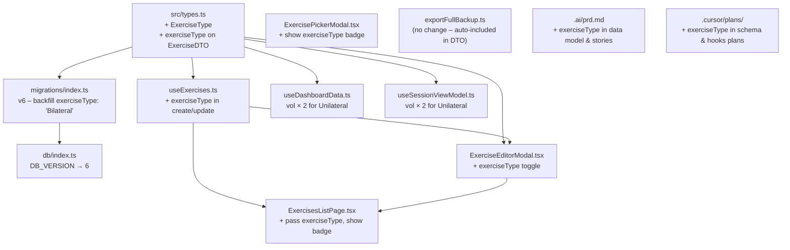

# Exercise Unilateral / Bilateral Type

## Architecture Overview



---

## 1. Type definitions — `[src/types.ts](src/types.ts)`

Add a new union type and extend `ExerciseDTO`:

```typescript
export type ExerciseType = "Unilateral" | "Bilateral";

export interface ExerciseDTO {
  // ... existing fields ...
  exerciseType?: ExerciseType; // defaults to "Bilateral" when absent
}
```

Extend `CreateExerciseCmd` and `UpdateExerciseCmd` to include `exerciseType?`:

- `CreateExerciseCmd`: add `exerciseType?: ExerciseType`
- `UpdateExerciseCmd` inherits via `Partial<Omit<ExerciseDTO, "id"|"createdAt">>`, so no explicit change needed there.

---

## 2. DB migration — `[src/lib/db/migrations/index.ts](src/lib/db/migrations/index.ts)` & `[src/lib/db/index.ts](src/lib/db/index.ts)`

- Bump `DB_VERSION` from `5` to `6` in `db/index.ts`.
- Add migration `6` in the registry: cursor-iterate the `exercises` store and backfill `exerciseType: "Bilateral"` for any record missing the field.

```typescript
6: async (db) => {
  const tx = db.transaction("exercises", "readwrite");
  const store = tx.objectStore("exercises");
  let cursor = await store.openCursor();
  while (cursor) {
    const ex = cursor.value as ExerciseDTO;
    if (!ex.exerciseType) {
      await cursor.update({ ...ex, exerciseType: "Bilateral" });
    }
    cursor = await cursor.continue();
  }
  await tx.done;
  console.log("[Migration v6] Backfilled exerciseType on exercises");
},
```

---

## 3. ExerciseEditorModal — `[src/components/settings/exercises/ExerciseEditorModal.tsx](src/components/settings/exercises/ExerciseEditorModal.tsx)`

- Extend `ExerciseEditorPayload` to include `exerciseType?: ExerciseType`.
- Add a two-option toggle/radio group (Bilateral / Unilateral) below the Notes field.
- Default to `"Bilateral"` when creating; pre-fill from `exercise.exerciseType` when editing.
- Pass `exerciseType` through `onSave`.

UI pattern (radio group styled as segmented toggle):

```tsx
<fieldset>
  <legend>Type</legend>
  {(["Bilateral", "Unilateral"] as ExerciseType[]).map((type) => (
    <label key={type}>
      <input
        type="radio"
        value={type}
        checked={exerciseType === type}
        onChange={() => setExerciseType(type)}
      />
      {type}
    </label>
  ))}
</fieldset>
```

---

## 4. ExercisesListPage — `[src/pages/settings/ExercisesListPage.tsx](src/pages/settings/ExercisesListPage.tsx)`

- Update `handleSaveExercise` payload type to include `exerciseType`.
- Pass `exerciseType` in both `createMutation.mutate` and `updateMutation.mutate` calls.
- Render a compact pill badge next to the exercise name in the list card (`Unilateral` or `Bilateral`). Only show the pill when the type is `"Unilateral"` (bilateral is the default and can remain implicit).

---

## 5. useExercises hook — `[src/hooks/useExercises.ts](src/hooks/useExercises.ts)`

- In `useCreateExercise.mutationFn`: include `exerciseType: cmd.exerciseType ?? "Bilateral"` when constructing the `ExerciseDTO`.
- In `onMutate` optimistic object: include `exerciseType`.
- In `useUpdateExercise.mutationFn`: the spread `...cmd` already propagates `exerciseType`.

---

## 6. ExercisePickerModal — `[src/components/sessionDetail/ExercisePickerModal.tsx](src/components/sessionDetail/ExercisePickerModal.tsx)`

- Display a small badge (`Unilateral`) next to the exercise name in the list button for exercises where `exerciseType === "Unilateral"`.
- The inline quick-create form does not expose `exerciseType` (defaults to `"Bilateral"`), keeping the fast logging flow friction-free.

---

## 7. Dashboard volume multiplier — `[src/hooks/useDashboardData.ts](src/hooks/useDashboardData.ts)`

All volume calculations currently use `set.weight * set.reps`. For unilateral exercises this should be `set.weight * set.reps * 2`.

**Strategy**: build an `exerciseTypeMap: Map<UUID, ExerciseType>` once inside `useDashboardData`'s `queryFn` by fetching all exercises that appear in the filtered sets. Pass this map into the compute functions.

```typescript
// helper
function volumeMultiplier(
  exerciseId: UUID,
  map: Map<UUID, ExerciseType>
): number {
  return map.get(exerciseId) === "Unilateral" ? 2 : 1;
}
```

Update the four compute functions:

- `computeTrendPoints`: `volume = set.weight * set.reps * volumeMultiplier(set.exerciseId, exerciseTypeMap)`
- `computeVolumePoints`: same multiplier
- `computeTotals`: same multiplier
- `computePRs`: **no change** — PR is max weight (single side), doubling would be misleading

The `exerciseTypeMap` is built once per query run from IDB using `db.get(STORE_NAMES.exercises, id)` for each unique exerciseId in the filtered sets — the same pattern already used for session fetching.

---

## 8. Session view model — `[src/hooks/useSessionViewModel.ts](src/hooks/useSessionViewModel.ts)`

Apply the same `×2` multiplier when computing per-session `totalVolume`. Fetch each unique exercise's `exerciseType` via the db and apply `volumeMultiplier` per set.

---

## 9. Backup — `[src/lib/utils/exportFullBackup.ts](src/lib/utils/exportFullBackup.ts)`

**No code changes required.** `buildFullBackup` reads `db.getAll(STORE_NAMES.exercises)` which returns full `ExerciseDTO` records including the new `exerciseType` field. Export and import of the field are therefore automatic.

Document-only note: the `FullBackupV1` interface uses `ExerciseDTO[]` so the new field is included transparently once the type is extended.

---

## 10. PRD update — `[.ai/prd.md](.ai/prd.md)`

Changes:

- **Data model** (Section 3): extend the Exercise definition with `exerciseType: "Unilateral" | "Bilateral" (default Bilateral)`.
- **New user story US-026**:
  - Title: Set exercise laterality (Unilateral / Bilateral)
  - Description: As the user, I can mark an exercise as Unilateral so that volume metrics are automatically doubled to reflect both sides.
  - Acceptance Criteria: (1) Exercise editor shows Bilateral/Unilateral selector defaulting to Bilateral. (2) Exercises list shows a pill badge for Unilateral exercises. (3) All volume calculations (dashboard and session totals) multiply by 2 for Unilateral exercises. (4) Backup includes exerciseType. (5) Existing exercises default to Bilateral via DB migration.
- **Acceptance checklist**: add `exerciseType` backfill migration and unilateral volume multiplier verified.

---

## 11. Plan documents update

- `**[.cursor/plans/indexeddb_schema_ef33b4bd.plan.md](.cursor/plans/indexeddb_schema_ef33b4bd.plan.md)`:
  - Add `exerciseType?: "Unilateral" | "Bilateral"` to the `exercises` store schema section.
  - Add note: "DB_VERSION bump to 6; migration backfills `exerciseType: 'Bilateral'`."
- `**[.cursor/plans/indexeddb_react_hooks_plan_80ebb75f.plan.md](.cursor/plans/indexeddb_react_hooks_plan_80ebb75f.plan.md)`:
  - Update `useExercises` / `useCreateExercise` / `useUpdateExercise` contracts to include `exerciseType`.
  - Add note to `useDashboardData` section about the unilateral volume multiplier.
