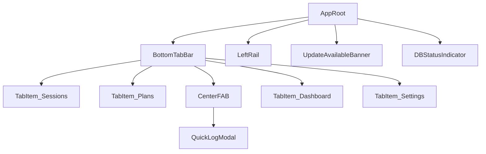

# View Implementation Plan - Navigation Tabs

## 1. Overview

A mobile-first primary navigation component providing bottom tab bar (mobile) and left rail (desktop) navigation with five entries: Sessions, Plans, Quick Log (center FAB), Dashboard, Settings. It enforces DB-ready/migration guards, surfaces service-worker update banners, and integrates with the Quick Log modal and routing.

## 2. View Routing

- Root shell mounts the navigation at `/` and provides tab routes:
  - `/sessions`
  - `/plans`
  - `/quick-log` (modal route or separate route)
  - `/dashboard`
  - `/settings`
- Implement route-aware active tab using React Router v6 `useLocation()` and `navigate()`.

## 3. Component Structure

- src/components/navigation/
  - BottomTabBar.tsx (responsive container) — mobile default
  - TabItem.tsx (single tab tile)
  - CenterFAB.tsx (Quick Log FAB with modal trigger)
  - LeftRail.tsx (desktop variant)
  - DBStatusIndicator.tsx (small inline indicator)
  - UpdateAvailableBanner.tsx (global SW update prompt)
  - useNavigation.ts (custom hook for nav state & guards)

Mermaid tree:



## 4. Component Details

### `BottomTabBar` ([src/components/navigation/BottomTabBar.tsx](src/components/navigation/BottomTabBar.tsx))

- Description: Responsive bottom tab container shown on small screens; positions center FAB and 2 tabs either side.
- Main elements: `<nav role="tablist" aria-label="Primary navigation">`, 4 `TabItem` components, 1 `CenterFAB`.
- Events handled: tab click -> navigate to path; long-press/hold (optional) -> show context menu (deferred); center FAB click -> open Quick Log modal.
- Validation conditions: disable navigation when `dbReady === false` and `upgrading === true` for destructive routes; show toast if navigation blocked.
- Types: `TabItemProps`, `BottomTabBarProps`.
- Props: optional `className`, optional `hidden` flag for full-screen modals.

### `TabItem` ([src/components/navigation/TabItem.tsx](src/components/navigation/TabItem.tsx))

- Description: Clickable tab tile with icon, label and optional badge.
- Main elements: `<button role="tab" aria-selected={active}>` with SVG icon and `<span>` label.
- Events: onClick -> navigate; onKeyDown (Enter/Space) -> activate; onFocus -> announce via aria-live if needed.
- Validation: highlight active state; accept `disabled` prop when navigation blocked.
- Types: `TabDTO`, `TabViewModel`.
- Props: `id`, `label`, `path`, `icon`, `badgeCount?`, `isActive`, `onActivate`.

### `CenterFAB` / `QuickLogTrigger` ([src/components/navigation/CenterFAB.tsx](src/components/navigation/CenterFAB.tsx))

- Description: Prominent circular FAB in center tab to open Quick Log; accessible and large (44–56px) target.
- Main elements: `<button aria-haspopup="dialog" aria-controls="quick-log-modal">` with icon.
- Events: click -> open Quick Log modal; keyboard Enter/Space -> open; when DB not ready -> open disabled and show toast.
- Validation: disabled when DB not ready or upgrading (unless Quick Log supports creating ad-hoc session transactionally — implement transactional attempt and fallback to prompt to create session).
- Props: `onOpen`, `ariaLabel`.

### `LeftRail` ([src/components/navigation/LeftRail.tsx](src/components/navigation/LeftRail.tsx))

- Description: Desktop/large-screen variant of `BottomTabBar`. Vertical layout, keyboard navigable.
- Elements: `<nav role="navigation" aria-label="Primary navigation">` list of `TabItem` entries.
- Events: same as `BottomTabBar`.
- Props: `collapsed?: boolean`.

### `DBStatusIndicator` ([src/components/navigation/DBStatusIndicator.tsx](src/components/navigation/DBStatusIndicator.tsx))

- Description: Small global indicator showing DB ready/upgrading/error; used in app shell and optionally in tabs.
- Elements: status icon + text tooltip.
- Props: `status: 'ready'|'upgrading'|'error'`, `migrationProgress?`.

### `UpdateAvailableBanner` ([src/components/navigation/UpdateAvailableBanner.tsx](src/components/navigation/UpdateAvailableBanner.tsx))

- Description: Non-blocking banner shown when SW update available; calls `onRefresh` when user accepts.
- Elements: banner with message, `Refresh` and `Dismiss` actions.
- Events: `onRefresh` -> calls SW update registration callback; `onDismiss` -> hides banner for session.
- Props: `visible`, `onRefresh`, `onDismiss`.

## 5. Types

Define in `src/types/navigation.ts`.

### `TabDTO`

```ts
export type TabId =
  | "sessions"
  | "plans"
  | "quickLog"
  | "dashboard"
  | "settings";
export interface TabDTO {
  id: TabId;
  label: string;
  path: string;
  icon: string; // icon key for shadcn/heroicons
  isCenter?: boolean;
}
```

### `TabViewModel`

```ts
export interface TabViewModel extends TabDTO {
  isActive: boolean;
  badgeCount?: number;
  disabled?: boolean;
}
```

### `NavState`

```ts
export interface NavState {
  activeTab: TabId;
  dbReady: boolean;
  upgrading: boolean;
  updateAvailable: boolean;
}
```

### Quick Log modal props

```ts
export interface QuickLogModalProps {
  open: boolean;
  onClose: () => void;
  initialExerciseId?: string;
}
```

## 6. State Management

- Local component state: activeTab derived from router location; `openQuickLog` boolean in shell.
- Global/Context state: `useDbInit()` provides { ready, upgrading, error } — import into `useNavigation()`.
- Custom hook: `useNavigation()` (in `src/hooks/useNavigation.ts`):
  - Responsibilities: build `tabs` array, compute `activeTab`, derive `disabled` states when DB not ready/upgrading, expose `navigateTo(tabId)` that enforces guards and optionally shows toast.
  - Exposed API: `{ tabs: TabViewModel[], activeTab, navigateTo, openQuickLog, setOpenQuickLog, updateAvailable, setUpdateAvailable }`.
- Prefer ephemeral UI state (modal open) in shell component; nav guards centralised in `useNavigation()` for reuse.

## 7. API Integration / Hooks

- No server endpoint required. Integrate with internal hooks:
  - `useDbInit()` — verify `ready`, `upgrading`.
  - `useSettings('navPref')` — optional to read `navPref` (e.g., show leftRail on large screens).
  - `useLogEvent('nav_click')` — optional telemetry for time-to-log metrics.
  - SW registration: `registerServiceWorker(onUpdate)` in `src/serviceWorker/register.ts` — when `onUpdate` fires, call `setUpdateAvailable(true)`.

Request/Response types: local only — interactions call hooks that use IndexedDB. No external JSON DTOs.

## 8. User Interactions

- Tap a tab: navigates to tab path; if `dbReady === false && upgrading === true` and target route performs destructive writes, show non-blocking info (toast) and block or queue the action.
- Tap Center FAB: opens Quick Log modal. If no active session exists, Quick Log logic should create an ad-hoc session transactionally (`useCreateSession()` + `useCreateLoggedSet()` inside `withTransaction`) or prompt user to create session.
- Long-press tab (future): show context actions (e.g., new session from plans) — deferred.
- Keyboard navigation: left/right or up/down to move focus between tabs; Enter/Space to activate; tablist ARIA roles.
- SW update banner action: `Refresh` triggers `registration.waiting.postMessage({type: 'SKIP_WAITING'})` flow and then `window.location.reload()` on success.

## 9. Conditions & Validation

- Condition: `useDbInit().ready === true` required for navigation to data-dependent views; if false, shell shows splash or read-only placeholder.
- Condition: `upgrading === true` should disable destructive interactions (create/delete) via `disabled` props; visual indication (opacity + tooltip) is required.
- Validate: Tab paths must match route config; `TabDTO.path` must match Router routes.
- Verify: On click, `navigateTo` must verify route exists and `dbReady` state; write unit tests asserting guard behavior.

## 10. Error Handling

- DB not ready / migration: show `DBStatusIndicator` and disable destructive nav; clicking disabled tab shows small toast with explanation and CTA to Settings.
- SW update failure: show banner with Retry; if refresh fails, surface message recommending manual refresh.
- Navigation failures (router errors): fallback to `/sessions` and show error toast.
- QuickLog transactional failure: rollback modal UI, show toast with Retry; ensure optimistic placeholder removed.

## 11. Implementation Steps

1. Create type definitions: `src/types/navigation.ts`.
2. Implement `useNavigation()` hook in `src/hooks/useNavigation.ts` (consume `useDbInit()` and `useSettings`).
3. Build `TabItem` component with accessible button and icon: `[src/components/navigation/TabItem.tsx](src/components/navigation/TabItem.tsx)`.
4. Build `BottomTabBar` layout and responsive Tailwind CSS; include `CenterFAB` slot: `[src/components/navigation/BottomTabBar.tsx](src/components/navigation/BottomTabBar.tsx)`.
5. Build `CenterFAB` and wire to open `QuickLogModal` (modal implementation exists at `src/components/quicklog/QuickLogModal.tsx` or create one).
6. Add `LeftRail` variant and CSS breakpoints; wire to show/hidden via CSS and `useSettings('navPref')`.
7. Integrate `DBStatusIndicator` and `UpdateAvailableBanner` into the App shell so both are visible above nav components.
8. Hook SW update registration: `src/serviceWorker/register.ts` → call `registerServiceWorker(() => setUpdateAvailable(true))` during app init when `process.env.NODE_ENV === 'production'`.
9. Add keyboard navigation behavior and ARIA roles; test with screen reader / keyboard-only.
10. Add tests (unit & integration):

- Tab rendering and active state by route
- `navigateTo` guards with DB states
- FAB opens Quick Log modal and creates ad-hoc session transactionally

1. Accessibility review: ensure hit targets >=44px, ARIA attributes present, color contrast ok.
2. QA: manual test on iOS Safari, ensure position of FAB and safe-area-inset for iPhone home indicator.
3. Perf & polish: avoid re-renders by memoizing TabViewModel and TabItem; lazy-load icons.

## 12. Files to Add / Update

- `src/components/navigation/BottomTabBar.tsx`
- `src/components/navigation/TabItem.tsx`
- `src/components/navigation/CenterFAB.tsx`
- `src/components/navigation/LeftRail.tsx`
- `src/components/navigation/DBStatusIndicator.tsx`
- `src/components/navigation/UpdateAvailableBanner.tsx`
- `src/hooks/useNavigation.ts`
- `src/types/navigation.ts`
- `src/serviceWorker/register.ts` (if not existing)

## Todos

- nav-1: Implement types and `useNavigation` hook
- nav-2: Implement `TabItem` and `BottomTabBar` (mobile-first)
- nav-3: Implement `CenterFAB` + wire QuickLog modal
- nav-4: Implement `LeftRail` for large screens
- nav-5: Add `DBStatusIndicator` & `UpdateAvailableBanner` integration
- nav-6: Accessibility & keyboard navigation tests
- nav-7: SW registration wire-up and manual QA on iOS Safari

---

Plan author: senior frontend developer
